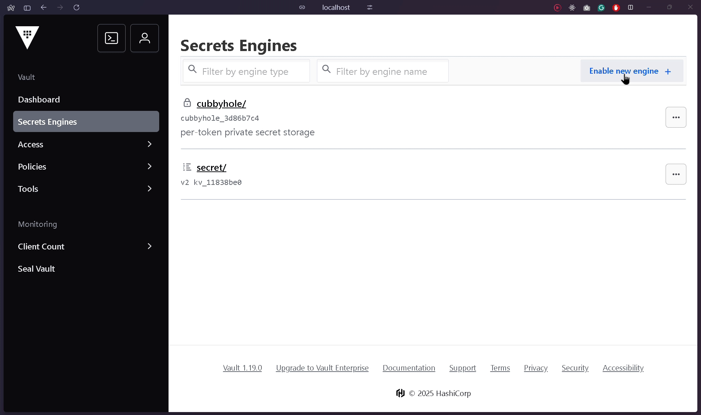

<div align="center">
<h1>goAIRA (Automated Issue Reporting Assistnat)</h1>
 A lightweight Go backend application that automates issue reporting using exposed REST APIs. It is an ideal tool for mid-sized to large organizations where sharing API tokens or other credentials poses a security risk.
</div>

## Pre-requisits :

| Application | Resource |
|-------------|----------|
| Go | [Reference](https://go.dev/doc/install) |
| docker | [Reference](https://docs.docker.com/engine/install/) |
| Git | [Reference](https://git-scm.com/downloads) |
| Postman | [Reference](https://www.postman.com/downloads/) |

> <b>Note</b> : You can use any API testing tool instead of postman as long as you are sending required headers and body content as part of API call

## Initial setup :

1. Clone [goAIRA](https://github.com/rebelnato/goAIRA) git repository to local .
```bash
git clone https://github.com/rebelnato/goAIRA.git
```
2. Create `.env` file in parent directory .
> i.e : If you are cloning repository inside `path/goAIRA` then location of `.env` file should be `path/goAIRA/.env`
3. Add `Vault_pass` attribute inside `.env` file . We'll update the vault token in here so that same can be added as environment variable in docker container.
```bash
Vault_pass=<vault access token>
```
4. Create `config.yml` file in parent directory , same as `.env` file . Add servicenow endpoints and consumer ids in the yaml file.
```yaml
endpoints:
  servicenow:  
    base: "https://<your-instance-id>.service-now.com/"
  vault:
    addr1: "localhost:8300"
    addr2: "vault:8200"

consumers:
  - "Test1"
  - "Test2"
```
5. Use below command to build and run docker container utilizing config of `docker-compose.yml` file .
```bash
docker-compose up -d --build
```
`-d` : Runs conatiner in background.

`--build` : Forces docker image rebuild before container starts.

6. Run below command to modify ownership and permission for `/vault` folder .
```bash
docker exec -it vault sh -c "chown -R 100:100 /vault && chmod -R 750 /vault"
```
7. Run below command to initiate vault , which will return 5 unseal key and 1 token key . Store the keys safe as we will need the in next steps to unseal vault and login.
```bash
docker exec -it vault sh -c "chown -R 100:100 /vault && chmod -R 750 /vault"

Sample output:

Unseal Key 1: <unseal_key_1>
Unseal Key 2: <unseal_key_2>
Unseal Key 3: <unseal_key_3>
Unseal Key 4: <unseal_key_4>
Unseal Key 5: <unseal_key_5>

Initial Root Token: <Root key>
```
8. Run below commands to unseal vault .
```bash
docker exec -it vault vault operator unseal <unseal_key_1>
docker exec -it vault vault operator unseal <unseal_key_2>
docker exec -it vault vault operator unseal <unseal_key_3>
```
9. Goto `http://localhost:8200` and use root key capture while initiating vault to login.
10. Create a new secret engine name `secret` .

11. Create 2 new secrets `SNOW` and `SNOW_refresh` inside `secret` engine .

12. Store below mentioned creds in associated secrets.
`SNOW` :
```json
{
  "client_id": "<ServiceNow client id>",
  "client_secret": "<Client password>",
  "password": "<ServiceNow users password>",
  "username": "<ServiceNow user name>"
}
```

`SNOW_refresh` :
```json
{
  "refresh_epoch_time": 0,
  "refresh_token": "<Keep it as "" , it will automatically be updated with appropriate vaule>"
}
```

